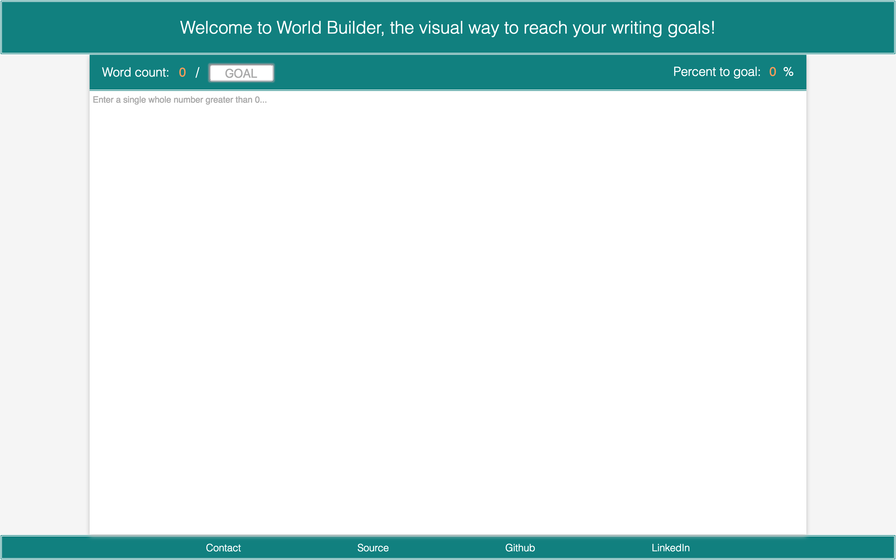
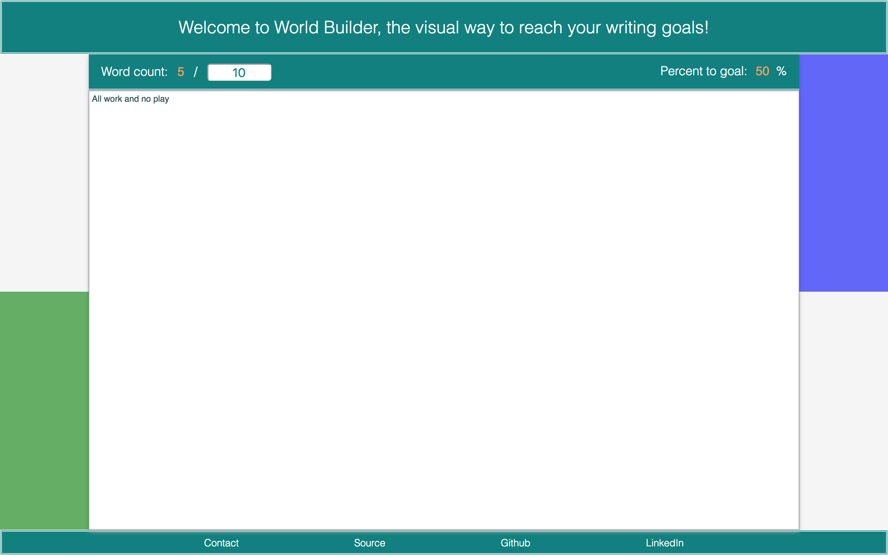
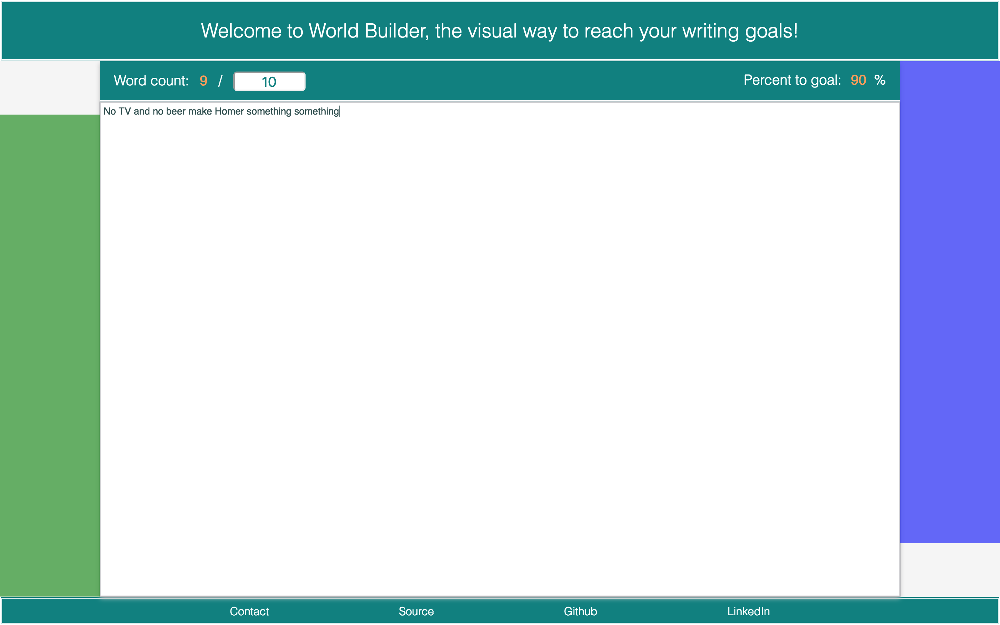
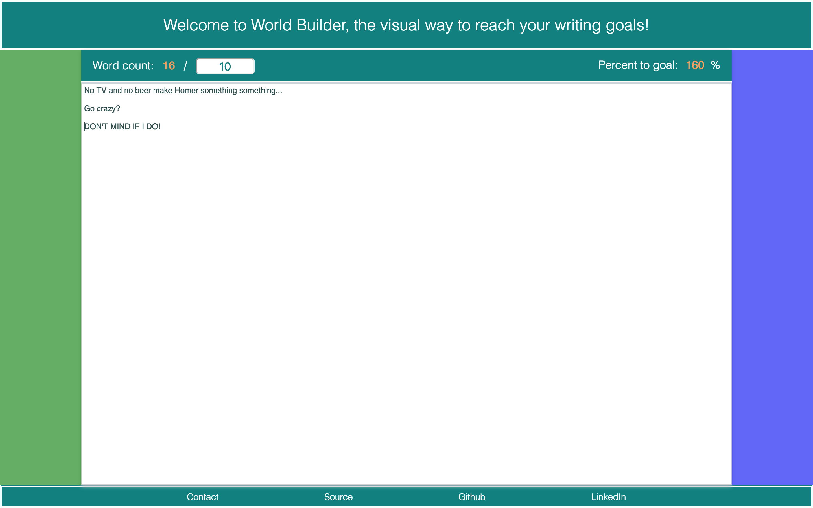
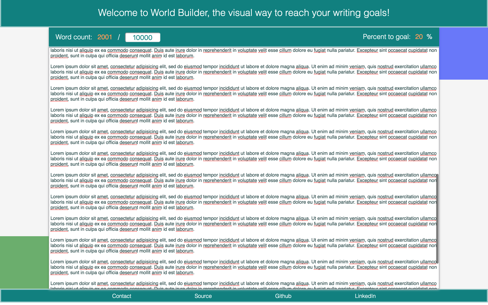

## Word Count World Builder

[Check it out here!][live]

A productivity app that helps you reach your word count goals with positive visual feedback!

[live]: https://erhsparks.github.io/WordCountWorldBuilder

### The App

When a user first encounters the app, the text box is disabled and its default text displays a prompt to enter the desired word count goal in the box labeled `GOAL`.


If a user types non-numbers or zero, that input is removed and the prompt changes to prompt users specifically for numbers.



Once a valid entry is detected, such as `10` in the example below, the prompt changes one last time, text entry is enabled, and you're off!





There is no penalty for continuing past your word count goal, as I figured it would break a user's flow of concentration and they might stop typing. The word and percentage counters continue to increase, however, so that users with a hard limit may edit as desired.



Long documents are handled by CSS with a continuous vertical scroll: `overflow-y: scroll;`.



### Implementation

The app is very simple, and as such I did not use a JS framework to build out the page, simply wrote the elements I was going to need (i.e. word count `<input type='text>`, the content `<textarea>`).

Styling is handled with CSS, using SASS for readability and flexibility, such as in reuse of a `bar` mixin for for the headers and footer:

```CSS
/* from assets/stylesheets/_header.scss */

.page-header {
  @include bar ($page-header-padding);
  font-size: 28px;
}
```

DOM manipulation is handled with jQuery for the app logic itself uses pure JavaScript.

In the example below, word count is determined by matching the value of the DOM element with class `.user-text` with a regular expression which looks for at least one non-whitespace character `\S+` with zero or more spaces to either side `\s*`. This is wrapped in an event listener for `input`, meaning any time keys are pressed or words are pasted/cut, which is obviously more robust than just listening for keypresses.

```JavaScript
// from lib/text_box.js

const watchTextBox = counts => {
  let $textBox = $('.user-text');

  $textBox.on('input', () => {
    let words = $textBox.val().match(/\s*\S+\s*/g);
    counts.numWords = words ? words.length : 0;

    updateCount(counts.numWords);
    updatePercentage(counts.numWords, counts.goal);
  });
};
```

The rest of the event listener in the above calls functions found in [update_display.js][update_display], which handle updating the DOM in response to word count or word count goal changes.

Similarly to the text box, the word count goal has an event listener found in [goal_box.js][goal_box_listener]. This is slightly more complicated because it calls functions which prevent the user from inputting invalid goals -- texteditor input is disabled with a helpful message as to why, and word count goal input only appears in its box if user input consists of only integers greater than zero.

The input checking is handled by some tidy regex which requires zero or more numerical digits `\d*` (so that 0001 is allowed), followed by one of the numbers 1 through 9 `[1-9]` and then as many other numbers 0 through 9 as desired `\d*`:

```JavaScript
// from lib/goal_box.js

const checkValidity = ($goalBox, counts) => {
  let entry = $goalBox.val();
  let $textBox = $('.user-text')[0];

  if (entry.match(/^\d*[1-9]\d*$/g)) {
    $goalBox.val(parseInt(entry));
    counts.goal = entry;
    enableTextBox($textBox);
  } else if (entry === '') {
    $goalBox.val('');
    disableTextBox($textBox, 'empty');
  } else {
    $goalBox.val('');
    disableTextBox($textBox, 'invalid');
  }
};

const enableTextBox = $textBox => {
  $textBox.disabled = false;
  $textBox.placeholder = 'Start typing here now!';
};

const disableTextBox = ($textBox, reason) => {
  let reasons = {
    empty: 'Enter a word count goal in the box above...',
    invalid: 'Enter a single whole number greater than 0...'
  };

  $textBox.disabled = true;
  $textBox.placeholder = reasons[reason];
};
```

The `enable` and `disable` options for the textBox are trivial and factored out for tidiness and DRYness.

The way I've written the above, typing in `001` will result in the `invalid` warning for both zeroes until the `1` is typed, but it means that if someone pastes in `001`, they won't run into any issues and `1` will appear in the box.

In breaking my code up into readable, DRY pieces, I initially ran into the problem that because I wasn't writing a `WordCount` class, it was difficult to update the `numWords` and `goal` variables from the event listeners because their values were primitives (strings or integers, depending at what point in the development process I was). I solved this by storing both in an object named `counts` by taking advantage of the fact that objects are passed to functions by reference, meaning that while setting a variable called `numWords` in a function would only change its value in that function's scope, setting a variable `counts.numWords` would mutate the `counts` object and the new value would persist. Score!

[update_display]: /lib/util/update_display.js
[goal_box_listener]: /lib/goal_box.js

### Future Directions

While super fun and motivating (I whipped this up on a whim but now find myself actually wanting something to have to type so that I can use it more -- where was this while I was in high school???), it's pretty lightweight. Here are some ideas for future improvements!

- Add ability to change font size for accessibility purposes.
- Expand the above to a simple rich-text editing toolbar.
- Add ability to export text to file.
- Add more skins!
- Add a congratulations message when user reaches 100% (and maybe an encouraging "you're halfway there!" message at 50%)
  - I considered flashing the progress bars but wasn't sure if there was an epilepsy concern there, and certainly wouldn't want to hurt any users!
